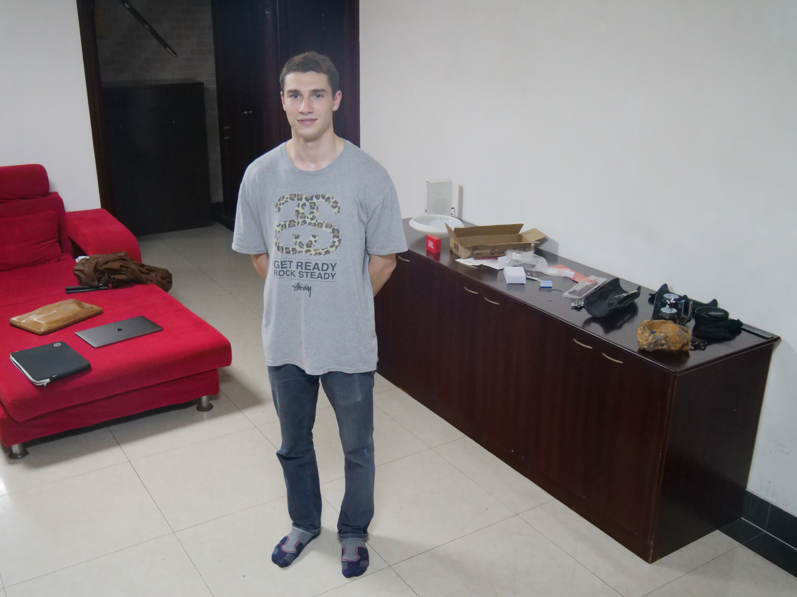
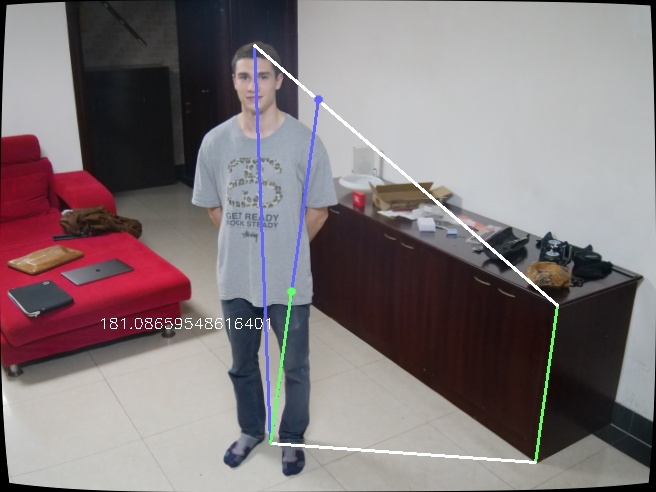

# Person-height
### Compute a person height in a photo given an object with know height

it calculates the relation in the tridimensional space between a person height and the one of a given object.

### Prerequisites
---

* Python 3
* top and base points of the person and object displayed in the image 
* enough lines to compute the ground plane. 
 

### Usage
---

run the following command:

```html
python measure_height.py
```

Then select with the mouse:

* 2 lines containing the person and the object heights 
* 4 background lines to compute the vanishing line

### Results

 
